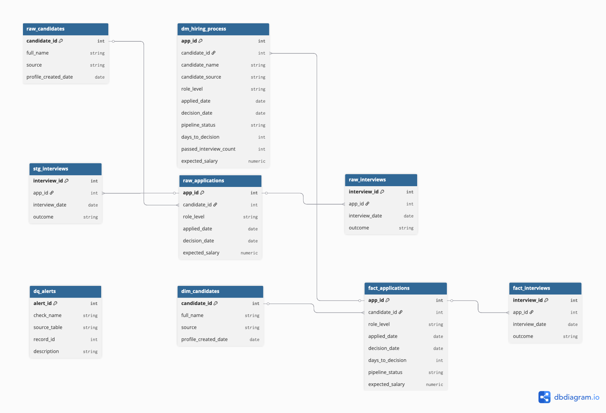

# JetBrains — People & HR Analytics Assessment

A data engineering pipeline that ingests raw Applicant Tracking System (ATS) data, cleans it, models it into a dimensional warehouse, and exposes business-ready analytics on hiring performance.

## What this project does

Companies like JetBrains receive hundreds of job applications across multiple channels. This pipeline answers key HR questions:

- **How many candidates are actively in our hiring pipeline each month?**
- **Which sourcing channels (LinkedIn, Referral, Career Page) produce the most hires over time?**
- **How long does it take to make a hiring decision per role level?**
- **Where is our ATS data dirty or inconsistent?**

The pipeline takes raw ATS exports, cleans them, organizes them into a star schema, and produces a data mart that any analyst or BI tool can query directly.

---

## Architecture

The pipeline follows a 4-layer warehouse architecture:

```
-------------------------------------------------------
│  SOURCE LAYER  (1_schema + 2_seed)                  │
│  raw_candidates · raw_applications · raw_interviews │
│  Immutable — never modified after load              │
-------------------------------------------------------
                        │
                        ▼
-------------------------------------------------------
│  STAGING LAYER  (3_staging)                         │
│  stg_candidates · stg_applications · stg_interviews │
│  Cleaned · Deduplicated · Validated                 │
│                                                     │
│  dq_alerts — logs all data quality issues found     │
-------------------------------------------------------
                        │
                        ▼
-------------------------------------------------------
│  DWH LAYER  (4_dwh)                                 │
│  dim_candidates · dim_roles                         │
│  fact_applications · fact_interviews                │
│  Star schema optimized for analytical queries       │
-------------------------------------------------------
                        │
                        ▼
-------------------------------------------------------
│  DATA MART  (5_mart + 6_analytics)                   │
│  dm_hiring_process                                   │
│  monthly_active_pipeline · cumulative_hires_by_source│
│  Business-ready · One row per application            │
-------------------------------------------------------
```

---

## Star schema

The DWH layer is modeled as a star schema with `fact_applications` at the center:

```
                    ---------------
                    │  dim_roles  │
                    │-------------│
                    │ role_level  │
                    │ level_order │
                    ---------------
                           │
        -------------------|----------------------
        │                  │                     │
------------------ ------------------- -----------------------
│ dim_candidates │ │fact_applications│ │  fact_interviews    │
│----------------│ │-----------------│ │---------------------│
│ candidate_id   │ │ app_id          │ │ interview_id        │
│ full_name      │ │ candidate_id    │ │ app_id              │
│ source         │ │ role_level      │ │ interview_date      │
│ created_date   │ │ applied_date    │ │ outcome             │
------------------ │ decision_date   │ -----------------------
                   │ days_to_dec.    │
                   │ pipeline_status │
                   -------------------
```

---

## Database schema



---

## Data quality checks

Every pipeline run scans raw data and logs issues to `dq_alerts` without blocking the load:

| Check | What it catches |
|-------|----------------|
| `interview_before_application` | Interview date is earlier than the application date |
| `decision_before_application` | Decision date is earlier than the application date |
| `duplicate_interview` | Same interview slot entered more than once in the ATS |

The staging layer also silently filters:

| Table | What gets filtered |
|-------|--------------------|
| `stg_candidates` | Rows with NULL `candidate_id` or NULL `full_name` |
| `stg_applications` | Rows with NULL ids or invalid `role_level` values |
| `stg_interviews` | Rows with invalid `outcome` values (e.g. 'Cancelled', 'Pending') |

---

## Analytical queries

### Monthly active pipeline
Counts how many applications were open in each calendar month. An application counts as active in every month between its `applied_date` and `decision_date`. Uses `GENERATE_DATE_ARRAY` + `UNNEST` to expand each application into one row per active month.

```sql
SELECT * FROM dwh.monthly_active_pipeline;
```

### Cumulative hires by source
Shows how each sourcing channel (LinkedIn, Referral, Career Page, Job Board) accumulates hires over time. A hire is a closed application with at least one Passed interview. Uses `SUM() OVER()` window function for the running total.

```sql
SELECT * FROM dwh.cumulative_hires_by_source;
```

---

## How to run

### Prerequisites
- Google account with access to [BigQuery console](https://console.cloud.google.com/bigquery)

### Setup steps
**1. Create the dataset**
In BigQuery console, create a dataset named `dwh` in your project with any region.

**2. Run SQL files in order**
| Step | File | What it does |
|------|------|-------------|
| 1 | `1_schema.sql` | Creates raw tables |
| 2 | `2_seed.sql` | Loads sample data (13 candidates, 18 applications, 28 interviews) |
| 3 | `3_staging.sql` | Cleans data, flags DQ issues |
| 4 | `4_dwh.sql` | Builds star schema |
| 5 | `5_mart.sql` | Creates `dm_hiring_process` |
| 6 | `6_analytics.sql` | Creates analytical views |

---

## Key tables reference

| Table | Layer | Description |
|-------|-------|-------------|
| `raw_candidates` | Source | Original candidate records from ATS |
| `raw_applications` | Source | Original application records from ATS |
| `raw_interviews` | Source | Original interview records from ATS |
| `stg_candidates` | Staging | Cleaned candidates (10 valid rows) |
| `stg_applications` | Staging | Cleaned applications (15 valid rows) |
| `stg_interviews` | Staging | Deduplicated interviews (23 valid rows) |
| `dq_alerts` | Staging | All data quality issues found |
| `dim_candidates` | DWH | Candidate dimension |
| `dim_roles` | DWH | Role level lookup (Junior/Senior/Executive) |
| `fact_applications` | DWH | Application facts with computed metrics |
| `fact_interviews` | DWH | Interview events |
| `dm_hiring_process` | Mart | One row per application, all metrics joined |
| `monthly_active_pipeline` | Analytics | Active applications per month |
| `cumulative_hires_by_source` | Analytics | Running hire totals per channel |

---

## Design decisions

- **BigQuery**: serverless, no infrastructure to manage, free tier sufficient for this scale
- **Layered architecture**: raw → staging → DWH → mart mirrors production warehouse patterns
- **Immutable raw layer**: raw tables are never modified — full audit trail preserved
- **DQ alerts table**: surfaces data issues without blocking the pipeline — errors are logged, not thrown
- **Deduplication via ROW_NUMBER()**: idempotent, preserves the earliest record
- **Star schema**: separates descriptive attributes (dims) from measurable events (facts) for clean analytical queries